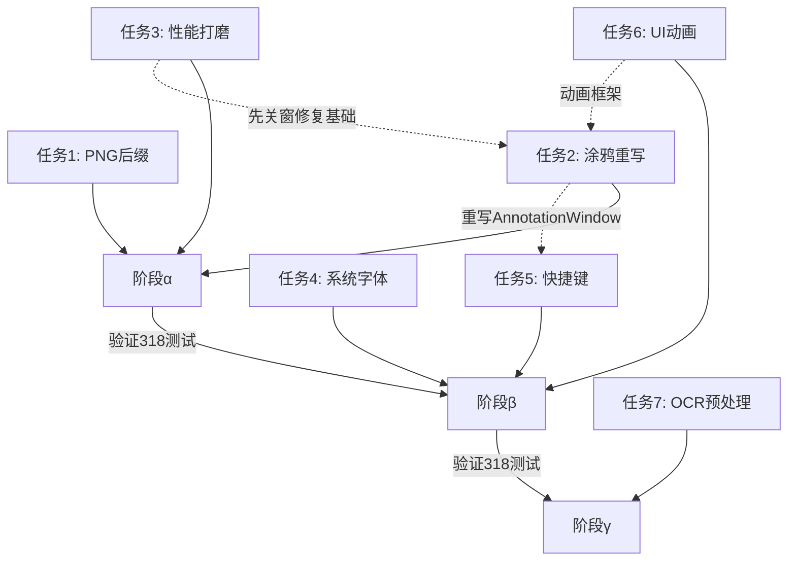

# TrueToneCap v0.4 长线规划

> **规划日期**：2026-08-25  
> **基线版本**：v0.3.2-beta (commit 0dd4215)  
> **基线测试**：318 通过 / 0 失败 (Core 47 | Color 81 | Encoding 14 | Service 5 | OCR 10 | Usability 161)  

---

## 📋 总览

| # | 任务 | 优先级 | 复杂度 | 预计工时 | 阶段 |
|---|------|--------|--------|----------|------|
| 1 | PNG 后缀描述更新 + JXL 支持 | P1 | 低 | 2h | α |
| 2 | 涂鸦组件重写 | P1 | 高 | 16h | α |
| 3 | 性能打磨（选区确定延迟等） | P0 | 中 | 12h | α |
| 4 | 系统字体检测 | P2 | 中 | 6h | β |
| 5 | 保存/取消快捷键自定义 | P2 | 低 | 4h | β |
| 6 | 过渡 UI 动画（可开关） | P2 | 中 | 8h | β |
| 7 | OCR 预处理改进 | P1 | 高 | 10h | γ |

**总计**：~58h 工作量，分 3 个阶段递进交付

---

## 阶段 α：核心体验修复（P0/P1）

### 任务 1：PNG 后缀描述更新 + JXL 支持

**现状**：
- `AvifPngSuffixChk` 复选框仅覆盖 AVIF 格式（`MainWindow.xaml` L129）
- 描述文案为"添加 .avif.png 双后缀（兼容旧软件）"
- JXL 格式无 PNG 后缀选项
- `CapturePipelineService.cs` L273: `if (format == OutputFormat.AVIF && s.AvifPngSuffix) ext += ".png";`

**改动**：
1. `AppSettingsData.cs`：新增 `JxlPngSuffix` 字段，默认 false
2. `MainWindow.xaml`：
   - AVIF 选项卡：复选框改名为 `PngSuffixChk`，描述改为"额外添加 .png 后缀来提高兼容性"
   - JXL 选项卡：新增同名复选框
3. `MainWindow.xaml.cs`：4 处读写绑定跟随更新
4. `CapturePipelineService.cs`：后缀逻辑扩展 JXL
5. `LocaleManager.cs`：双语更新
6. `EncodingSettings`（Core）：新增 `JxlPngSuffix` 字段

**风险**：低。复制现有 `AvifPngSuffix` 模式即可

---

### 任务 2：涂鸦组件重写

**现状分析**（`AnnotationWindow.xaml.cs`）：
- `AnnotationCanvas` 是 WinUI 3 `Canvas`，坐标用 `CanvasToImage`/`ImageToCanvas` 双向转换
- **核心问题**：标注 Canvas 与 `PreviewImage` 的 `SizeChanged` 同步是异步的，窗口缩放/大图场景下 Canvas 实际尺寸滞后 → 点击位置偏移
- `RenderAllLayers()` 在 `AnnotationCanvas.Children.Clear()` 后用绝对坐标重建所有元素，每次拖动都清空+重建 → 性能差
- 缺少图层管理面板（无法选中/移动/删除已绘制的标注）
- 无缩放/平移支持，大图（4K）无法精确操作

**设计方案**：
```
新架构: AnnotationWindow v2
├── 画布层: Canvas → 改用 Canvas + 画布变换 (CompositeTransform)
│   ├── 支持滚轮缩放 (0.25x ~ 8x)
│   ├── 支持空格+拖拽平移
│   └── 标注坐标恒定为图像原始像素 (不再依赖 Canvas 实际尺寸)
├── 交互层:
│   ├── 选中工具 (V): 点击标注 → 选中 → 拖拽移动 → Del 删除
│   ├── 绘制工具: 实时预览用单独 _previewShape (不清空已渲染层)
│   └── 笔触工具: 流畅贝塞尔插值 (替代折线)
├── 图层面板 (右侧浮动):
│   ├── 图层列表 (可见/锁定/删除)
│   ├── 不透明度滑块
│   └── 颜色选择器 (替代固定红色)
└── 性能优化:
    ├── 已完成标注 → 预渲染到 WriteableBitmap (避免每次 Clear+重建)
    ├── 仅当前预览走 UI 元素
    └── 大图缩放视口剔除 (只渲染可见范围)
```

**关键文件**：
- `AnnotationWindow.xaml` — 完整重写
- `AnnotationWindow.xaml.cs` — 完整重写
- `AnnotationManager.cs` — 扩展选中/移动/删除能力
- `AnnotationLayer.cs` — 新增 Selected 属性

**注意**：`SelectionOverlay.xaml.cs` 内联标注模式（也用 `AnnotationManager`）需要同步更新交互逻辑

---

### 任务 3：性能打磨 — 选区确定延迟 + 综合分析

#### 3a. 选区"确定"按钮延迟（P0 修復）

**根因分析**（`SelectionOverlay.xaml.cs` `Finish()` 方法 L650~）：
```
用户点击"确定"
  → Finish(Confirm) 被调用 [UI 线程]
  → 标注合成: Task.Run(GetAnnotatedRegionPixels) + await Task.WhenAny(composeTask, 10s)
  → ↑ 无标注时: ExtractRegionPixels(SelectedRect) — 同步提取区域像素 [UI 线程阻塞!]
  → _hdrBgWnd?.Close() — 同步关闭 HDR 背景窗口
  → ActionCompleted?.Invoke(result, rect) — 触发回调
  → this.Close() — 关闭窗口
```

**问题**：
1. `ExtractRegionPixels` 在 UI 线程同步执行（大图 4K 区域提取 = 4×strides `Buffer.BlockCopy`）
2. `ActionCompleted` 回调内 `await EncodeAndSaveAsync()` — 编码发生在覆盖层关闭前
3. HDR 背景窗口 `Close()` 可能有 GPU 资源释放延迟

**修复方案**：先关窗口，后做合成+编码
```
Finish(Confirm):
  1. _finished = true (防重入)
  2. 停止定时器/看门狗
  3. 提取选区像素 (Task.Run, 最多 200ms)
  4. ★ 先 this.Close() + _hdrBgWnd?.Close() (UI 即刻消失)
  5. 再 ActionCompleted?.Invoke (触发编码)
```

**关键改动**：`Finish()` 方法将 `Close()` 提前到 `ActionCompleted` 之前

#### 3b. 各组件性能占用分析

| 组件 | 热点操作 | 当前耗时 (4K) | 优化方向 |
|------|---------|-------------|---------|
| WGC 捕获 | FrameArrived → staging copy | ~5ms | 已优化（三缓冲池化） |
| SelectionOverlay | 像素提取 + 标注合成 | ~20-50ms | Task.Run + 先关窗 |
| AnnotationWindow | RenderAllLayers Clear+重建 | ~10ms/次 | 预渲染 WriteableBitmap |
| EncodeAndSaveAsync | ICC 烘焙 + 编码 | ~80-300ms | 异步 + Toast 延迟提示 |
| CopyToClipboard | 文件复制 + Clipboard.SetFileDropList | ~20ms | 已异步 |
| ShowToast | Toast UI 创建 | ~5ms | 已异步 |
| OCR 预处理 | AutoPreprocess (对比度/放大) | ~30-80ms | 已在 Task.Run |

**综合建议**：
1. **选区确定先关窗**（3a） — 最直观的卡顿来源
2. **编码进度 Toast**：选区确定后先显示"编码中..."Toast，编码完成后更新为成功 Toast
3. **AnnotationWindow 窗口创建延迟**：`RenderRawPixels` 用 `async void` + `SoftwareBitmap` — 大图首次渲染 20-50ms，可改用直接 `WriteableBitmap` + `PixelData.AsStream().Write()` 取代 `SoftwareBitmap.CopyFromBuffer`
4. **SelectionOverlay 背景渲染**：已有 GPU 加速 (HdrBgWindow) — 无需优化
5. **MainWindow 状态更新**：`DispatcherQueue.TryEnqueue` 高频调用 — 建议批量合并

---

## 阶段 β：功能增强（P2）

### 任务 4：系统字体检测

**现状**（`FontLoader.cs`）：
- `FontLoader` 仅有 `DefaultFontFamily` 常量和 `GetEffectiveFontFamily` — 不枚举系统字体
- 用户只能在设置中手动输入字体名称
- `publish/PACKAGE.md` 已声明"用户可通过系统设置选择已安装系统字体"，但实际未实现

**设计方案**：
```
FontLoader.cs 扩展:
├── GetSystemFonts(): IReadOnlyList<FontInfo>
│   ├── Win32: EnumFontFamiliesEx (GDI32, 逻辑字体枚举)
│   ├── 去重 + 按名称排序
│   └── 返回 FontInfo { Name, DisplayName }
├── 发送到 UI 后用 ComboBox 替代 TextBox
└── 字体预览: 每项用自身字体渲染名称
```

**实现要点**：
- Win32 `EnumFontFamiliesEx` P/Invoke (charset = DEFAULT_CHARSET 枚举所有)
- 右键字体名 → 用 `Microsoft.UI.Xaml.Media.FontFamily` 验证可加载性
- 设置页 `FontFamilyTxt` TextBox → 改为 `FontFamilyCbo` ComboBox + 预览

---

### 任务 5：保存/取消快捷键自定义

**现状**：
- `AnnotationWindow.xaml.cs` L91: 固定 `Enter=复制`、`S=保存`、`Esc=丢弃`
- `SelectionOverlay.xaml.cs` L362: 固定 `Enter=确定`、`Esc=取消`
- 设置页有 3 个快捷键录制（选区截图/录制/无感截图），但无保存/取消快捷键

**设计方案**：
1. `AppSettingsData.cs`：新增 `SaveShortcut` (默认 "S") 和 `CancelShortcut` (默认 "Esc")
2. `MainWindow.xaml` 设置页：新增 2 个快捷键录制行（复用 `StartHotkeyRecording` 模式）
3. `AnnotationWindow` / `SelectionOverlay`：从 `AppServices.Settings.Current` 读取快捷键
4. 快捷键解析支持单键（如 S）和组合键（如 Ctrl+S）

**注意事项**：单键录制需要修改 `OnHotkeyRecordKeyDown`（当前忽略纯修饰键但不能录制单字母）

---

### 任务 6：过渡 UI 动画（可开关）

**现状**：`MainWindow.xaml` 无任何过渡动画

**设计方案**：
1. `AppSettingsData.cs`：新增 `EnableUiAnimations` (默认 true)
2. 设置页新增开关："启用界面过渡动画"
3. 动画范围：
   - 设置面板切换：`PageContent` 区域 FadeIn/FadeOut (150ms)
   - 格式/色彩面板展开/折叠：HeightAnimation (200ms)
   - 质量滑块/色度面板联动：Opacity + TranslationTransition
   - 状态文本更新：FadeIn (100ms)
4. 实现方式：
   - WinUI 3 内置 `Storyboard` + `DoubleAnimation`
   - 封装 `AnimationHelper` 静态类 — 开关关闭时所有动画方法短路
5. 性能考量：动画用 Composition Animation（GPU 加速），不影响 UI 线程

---

## 阶段 γ：OCR 预处理深度改进

### 任务 7：OCR 预处理优化

**现状分析**（`BitmapPreprocessor.cs`）：
```
AutoPreprocess 规则:
  1. w<400 || h<200 → ScaleUp 2x (双线性)
  2. contrast < 40 → EnhanceContrast (直方图拉伸)
     └─ 若增强后 contrast < 60 → AdaptiveThreshold
  3. 高对比度 → 不处理
```

**问题**：
1. **尺寸阈值过低**：截图常见 ≥1080p，但截图区域可能局部小字 → `w<400` 不触发→小字不带放大
2. **对比度阈值静态**：截图背景多样（白色/深色/渐变/彩色），`contrast<40` 不适配所有场景
3. **自适应二值化窗口固定 11×11**：对小字（20px）过大，对大字（80px）过小
4. **无降噪**：截图可能有 JPEG 压缩噪声 → 文字边缘模糊 → 检测误判
5. **无背景颜色检测**：深色背景+白字 → 直接二值化会反转（文字变白→判断为背景）

**改进方案**：
```
新预处理管线:
  1. 智能背景检测:
     a. 采样四角 + 中心区域 → 判断背景明暗 (dark/light)
     b. 深色背景 → 反转 (invert) 后统一处理
  
  2. 自适应放大:
     a. 检测最小文字高度 (连通域分析 or 投影剖面)
     b. 若 <32px → 放大到 ≥32px (PP-OCRv6 最佳识别尺寸)
     c. 高质量 Lanczos 重采样 (替代双线性)
  
  3. 局部对比度增强 (CLAUSHE 替代全局直方图拉伸):
     a. 8×8 分块 CLAUSHE (限制对比度自适应直方图均衡)
     b. 避免全局拉伸放大噪声
  
  4. 改进自适应二值化:
     a. Sauvola 算法 (替代局部均值法)
        - 基于局部均值+标准差, 自适应阈值
        - 对光照不均/渐变背景效果显著
     b. 窗口大小动态: min(文字高度×3, 75) 
     c. SIMD 加速 (PixelOps AVX2)
  
  5. 降噪 (可选):
     a. 二值化前: 3×3 中值滤波 (去除 JPEG 块噪声)
     b. 仅在检测到噪声 (高频分量 > 阈值) 时启用
```

**验证方式**：
- 复用 `OcrAccBench`（Tools 项目）对比优化前后准确率
- 测试场景：白底黑字、深色背景白字、渐变背景、小字(12px)、彩色背景

**关键文件**：
- `BitmapPreprocessor.cs` — 主要改动
- `OnnxOcrEngine.cs` — 检测最小文字高度的辅助方法
- `PixelOps.cs` — 新增 Sauvola SIMD 内核（可选）

---

## 🔗 依赖关系图



---

## 📊 验收标准

| 阶段 | 验收项 |
|------|--------|
| α 完成 | 318+ 测试全通过；选区确定 <16ms UI 消失；PNG后缀支持 JXL+AVIF |
| β 完成 | 系统字体枚举正确；快捷键 SaveKey/CancelKey 可自定义+持久化；动画开关有效 |
| γ 完成 | OCR 准确率提升 ≥5%（合成图基准）；深色背景文字正确识别 |

---

## 📝 版本里程碑

- **v0.4.0-alpha**：阶段 α 完成（内部测试）
- **v0.4.0-beta**：阶段 α+β 完成（发布公测）
- **v0.4.0**：阶段 γ 完成后正式版

---

## ⚠️ 风险与缓解

| 风险 | 影响 | 缓解措施 |
|------|------|---------|
| 涂鸦重写回归 | SelectionOverlay 内联标注也受影响 | 分模块提交；每步验证 318 测试 |
| Sauvola 算法性能 | 大图 4K 预处理 >100ms | SIMD 加速 + 仅对选区区域处理 |
| 快捷键录制单键支持 | 可能与 letter 键冲突 | 建议组合键（Ctrl+S）为默认 |
| UI 动画 WinUI 3 限制 | Storyboard 在动画中断时状态不一致 | 用 `Implicit Animations` (Composition) 更稳定 |
